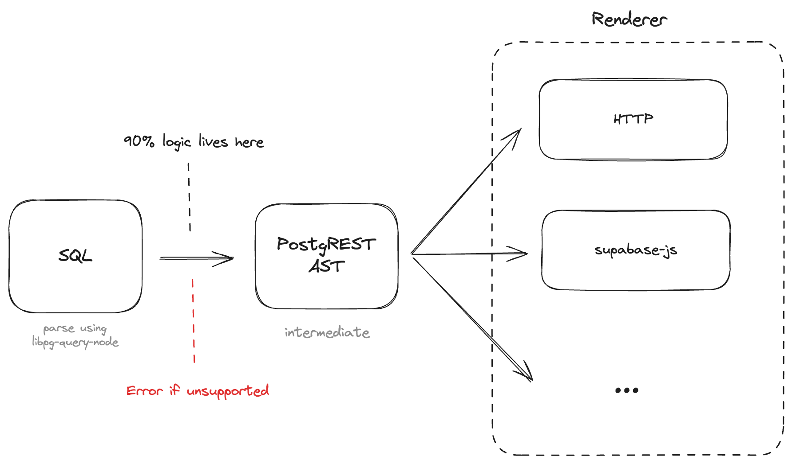

# SQL to PostgREST translator

[](https://www.npmjs.com/package/@supabase/sql-to-rest)
[](#license)

TypeScript library that translates SQL queries to the equivalent [PostgREST](https://github.com/PostgREST/postgrest)-compitable HTTP requests and client library code. Works on both browser and server.

### What is PostgREST?

[PostgREST](https://postgrest.org/) is a REST API that auto-generates endpoints based on relations in your database (`public` schema only by default). It uses JWTs and RLS policies to handle authorization.

### How can SQL be converted to REST?

The PostgREST API supports a lot of SQL-like features including:

- Vertical filtering (select only the columns you care about)
- Horizontal filtering (filter rows by comparing data in columns: `=`, `>`, `<`, `in`, `like`, etc)
- Sorting
- Limit and offset
- Resource embeddings (joins to other relations using foreign keys)
- Aggregate operations (`count()`, `sum()`, `avg()`, `min()`, `max()`)
- Nested `AND`/`OR` expressions
- Aliasing and casting
- JSON columns (selecting, filtering, and sorting)

This library takes the SQL input and translates it to 1-to-1 to the equivalent PostgREST syntax. Any unsupported SQL will [throw an error](#sql-is-a-very-open-language---how-can-it-all-translate-to-rest).

### Example

The following SQL:

```sql
select
  title,
  description
from
  books
where
  description ilike '%cheese%'
order by
  title desc
limit
  5
offset
  10
```

Will get translated to:

_cURL_

```shell
curl -G http://localhost:54321/rest/v1/books \
  -d "select=title,description" \
  -d "description=ilike.*cheese*" \
  -d "order=title.desc" \
  -d "limit=5" \
  -d "offset=10"
```

_Raw HTTP_

```http
GET /rest/v1/books?select=title,description&description=ilike.*cheese*&order=title.desc&limit=5&offset=10 HTTP/1.1
Host: localhost:54321
```

_supabase-js_

```js
const { data, error } = await supabase
  .from('books')
  .select(
    `
    title,
    description
    `
  )
  .ilike('description', '%cheese%')
  .order('title', { ascending: false })
  .range(10, 15)
```

## Install

```shell
npm i @supabase/sql-to-rest
```

```shell
yarn add @supabase/sql-to-rest
```

## Usage

_Note: This library is pre-1.0, so expect slight API changes over time._

```js
import { processSql, renderHttp, formatCurl } from '@supabase/sql-to-rest'

// Process SQL into intermediate PostgREST AST
const statement = await processSql(`
  select
    *
  from
    books
`)

// Render the AST into an HTTP request
const httpRequest = await renderHttp(statement)

// Format the HTTP request as a cURL command (requires base URL)
const curlCommand = formatCurl('http://localhost:54321/rest/v1', httpRequest)

console.log(curlCommand)
// curl http://localhost:54321/rest/v1/books

// Or use it directly
const response = await fetch(`http://localhost:54321/rest/v1${httpRequest.fullPath}`, {
  method: httpRequest.method,
})
```

### `processSql()`

Takes a SQL string and converts it into a PostgREST abstract syntax tree (AST) called a `Statement`. This is an intermediate object that can later be rendered to your language/protocol of choice.

```js
import { processSql } from '@supabase/sql-to-rest'

const statement = await processSql(`
  select
    *
  from
    books
`)
```

Outputs a `Promise<Statement>`:

```js
{
  type: 'select',
  from: 'books',
  targets: [
    {
      type: 'column-target',
      column: '*',
      alias: undefined,
    },
  ],
  filter: undefined,
  sorts: [],
  limit: undefined
}
```

### `renderHttp()`

Takes the intermediate `Statement` and renders it as an HTTP request.

```js
import { processSql, renderHttp } from '@supabase/sql-to-rest'

const statement = await processSql(`
  select
    *
  from
    books
`)

const httpRequest = await renderHttp(statement)
```

Outputs a `Promise<HttpRequest>`:

```js
{
  method: 'GET',
  path: '/books',
  params: URLSearchParams {},
  fullPath: [Getter] // combines path with the query params
}
```

An `HttpRequest` can also be formatted as a `cURL` command or as raw HTTP.

#### cURL command

```js
import {
  // ...
  formatCurl,
} from '@supabase/sql-to-rest'

// ...

const curlCommand = formatCurl('http://localhost:54321/rest/v1', httpRequest)
```

Outputs:

```shell
curl http://localhost:54321/rest/v1/books
```

#### Raw HTTP

```js
import {
  // ...
  formatHttp,
} from '@supabase/sql-to-rest'

// ...

const rawHttp = formatHttp('http://localhost:54321/rest/v1', httpRequest)
```

Outputs:

```http
GET /rest/v1/books HTTP/1.1
Host: localhost:54321
```

### `renderSupabaseJs()`

Takes the intermediate `Statement` and renders it as [`supabase-js`](https://github.com/supabase/supabase-js) client code.

```js
import { processSql, renderSupabaseJs } from '@supabase/sql-to-rest'

const statement = await processSql(`
  select
    *
  from
    books
`)

const { code } = await renderSupabaseJs(statement)
```

Outputs a `Promise<SupabaseJsQuery>`, where `code` contains:

```js
const { data, error } = await supabase.from('books').select()
```

The rendered JS code is automatically formatted using `prettier`.

## How does it work?

<picture>
  <source media="(prefers-color-scheme: dark)" srcset="./assets/diagram-dark.png">
  
</picture>

1. The SQL string is parsed into a PostgreSQL abstract syntax tree (AST) using [`libpg-query-node`](https://github.com/launchql/libpg-query-node), a JavaScript SQL parser that uses C code from the official PostgreSQL codebase (compiled to WASM for browser targets, NAPI for Node targets). Supports Postgres 15 syntax.
2. The PostgreSQL AST is translated into a much smaller and simpler PostgREST AST. Since PostgREST supports a subset of SQL syntax, any unsupported SQL operation will throw an `UnsupportedError` with a description of exactly what wasn't supported.
3. The intermediate PostgREST AST can be rendered to your language/protocol of choice. Currently supports HTTP (with `cURL` and raw HTTP formatters), and [`supabase-js`](https://github.com/supabase/supabase-js) code (which wraps PostgREST). Other languages are on the roadmap (PR's welcome!)

## Roadmap

### SQL features

#### Statements

- [x] `select` statements ([`GET` requests](https://postgrest.org/en/latest/references/api/tables_views.html#read))
- [ ] `insert` statements ([`POST` requests](https://postgrest.org/en/latest/references/api/tables_views.html#insert))
  - [ ] `on conflict update` ([upsert](https://postgrest.org/en/latest/references/api/tables_views.html#upsert))
- [ ] `update` statements ([`PATCH` requests](https://postgrest.org/en/latest/references/api/tables_views.html#update))
- [ ] `delete` statements ([`DELETE` requests](https://postgrest.org/en/latest/references/api/tables_views.html#delete))
- [ ] `explain` statements ([Execution plan](https://postgrest.org/en/latest/references/observability.html#execution-plan))

#### [Filters](https://postgrest.org/en/latest/references/api/tables_views.html#horizontal-filtering)

##### Column operators

- [x] `=` (`eq`)
- [x] `>` (`gt`)
- [x] `>=` (`gte`)
- [x] `<` (`lt`)
- [x] `<=` (`lte`)
- [x] `<>` or `!=` (`neq`)
- [x] `like` (`like`)
- [x] `ilike` (`ilike`)
- [x] `~` (`match`)
- [x] `~*` (`imatch`)
- [x] `in` (`in`)
- [ ] `is` (`is`): _partial support, only `is null` for now_
- [ ] `is distinct from` (`isdistinct`)
- [x] `@@` (`fts`, `plfts`, `phfts`, `wfts`)
- [ ] `@>` (`cs`)
- [ ] `<@` (`cd`)
- [ ] `&&` (`ov`)
- [ ] `<<` (`sl`)
- [ ] `>>` (`sr`)
- [ ] `&<` (`nxr`)
- [ ] `&>` (`nxl`)
- [ ] `-|-` (`adj`)

##### Logical operators

- [x] `not` (`not`)
- [x] `or` (`or`)
- [x] `and` (`and`)
- [ ] `all` (`all`)
- [ ] `any` (`any`)

#### [Ordering](https://postgrest.org/en/latest/references/api/tables_views.html#ordering)

- [x] `asc` (`asc`)
- [x] `desc` (`desc`)
- [x] `nulls first` (`nullsfirst`)
- [x] `nulls last` (`nullslast`)

#### [Pagination](https://postgrest.org/en/latest/references/api/pagination_count.html)

- [x] `limit` (`limit`)
- [x] `offset` (`offset`)
- [ ] HTTP range headers

#### [Aggregates](https://postgrest.org/en/latest/references/api/aggregate_functions.html)

##### Functions

- [x] `count()`
- [x] `sum()`
- [x] `avg()`
- [x] `max()`
- [x] `min()`

##### Features

- [x] aggregate over entire table
- [x] aggregate on joined table column
- [x] aggregate with `group by`
- [x] aggregate with `group by` on joined table column

#### [Joins](https://postgrest.org/en/latest/references/api/resource_embedding.html) (Resource Embedding)

SQL joins are supported using PostgREST resource embeddings with the [spread `...` syntax](https://postgrest.org/en/latest/references/api/resource_embedding.html#spread-embedded-resource) (flattens joined table into primary table).

#### [Aliases](https://postgrest.org/en/latest/references/api/tables_views.html#renaming-columns)

- [x] column aliases
- [x] table aliases

#### [Casts](https://postgrest.org/en/latest/references/api/tables_views.html#casting-columns)

- [x] column casts (in select target only)
- [x] aggregate function casts (in select target only)

#### [JSON columns](https://postgrest.org/en/latest/references/api/tables_views.html#json-columns)

JSON columns (eg. `select metadata->'person'->>'name'`) are supported in the following places:

- [x] select targets
- [x] filters
- [x] sorts

### Renderers

- [x] HTTP
  - [x] cURL formatter
  - [x] Raw HTTP formatter
- [x] [`supabase-js`](https://github.com/supabase/supabase-js)
- [ ] [`supabase-flutter`](https://github.com/supabase/supabase-flutter)
- [ ] [`supabase-swift`](https://github.com/supabase/supabase-swift)
- [ ] [`supabase-py`](https://github.com/supabase-community/supabase-py)
- [ ] [`supabase-csharp`](https://github.com/supabase-community/postgrest-csharp)
- [ ] [`supabase-kt`](https://github.com/supabase-community/supabase-kt)

## FAQs

### Are you parsing SQL from scratch?

Thankfully no. We use [`libpg-query-node`](https://github.com/launchql/libpg-query-node) which takes source code from the real PostgreSQL parser and wraps it in JavaScript bindings. It compiles the C code into WASM for browser environments and uses native NAPI bindings for server environments.

This means we never have to worry about the SQL itself getting parsed incorrectly - it uses the exact same code as the actual PostgreSQL database. This library uses code from PostgreSQL 15.

### SQL is a very open language - how can it all translate to REST?

It can't. PostgREST only supports a subset of SQL-like features (by design), so this library only translates features that can be mapped 1-to-1.

When it detects SQL that doesn't translate (eg. sub-queries), it will throw an `UnsupportedError` with a description of exactly what couldn't be translated.

### How can I be confident that my SQL is translating correctly?

We've built [unit tests](./src/renderers/http.test.ts) for every feature supported. The vast majority of PostgREST features have been implemented, but it doesn't cover 100% yet (see [Roadmap](#roadmap)). If you discover an error in the translation, please [submit an issue](https://github.com/supabase-community/sql-to-rest/issues/new/choose).

## License

MIT
